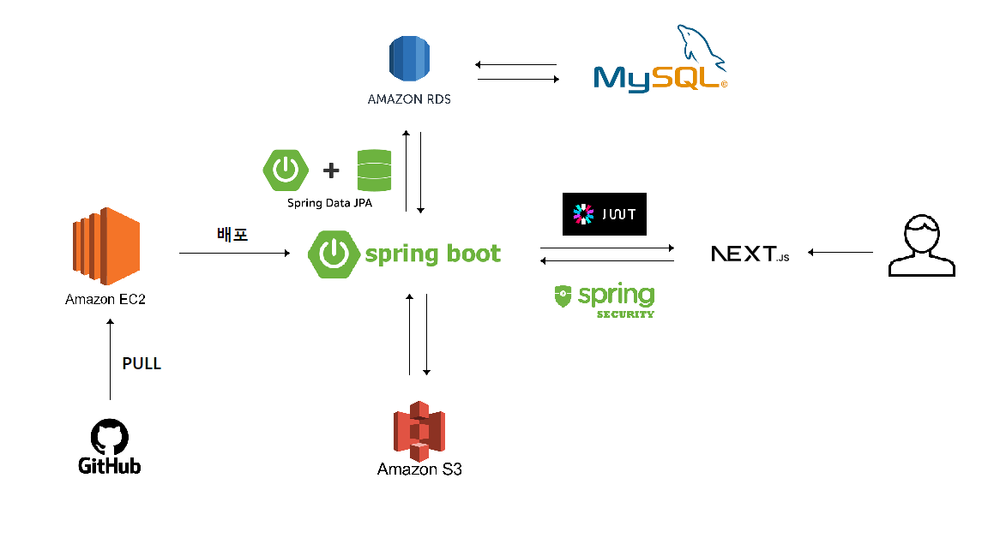

# MoGu

## 구조도

## 목표

- GitHub에 Git-Flow 브랜치전략을 도입해 협업 진행해보기
- JPA를 적용해보고 성능이나 가독성, 유지보수성 측면에서 코드를 리팩토링 해보기
- AWS EC2를 이용해 배포까지 진행해보기

 

## 사용기술

Java, SpringBoot, SpringDataJpa, SpringSecurity, MySql, AWS(EC2, RDS, S3)

 

## ERD

 

## 주요기능

- 회원 CRUD
- 유저 별 게시물 필터링(좋아요 여부, 댓글 여부, 카테고리 등 기준)
- 구인 게시판(프로젝트, 스터디) CRUD
- 커뮤니티 게시판(개인 프로젝트, 팀 프로젝트, 자유로운 글) CRUD
- 좋아요 기능
- 게시물 리스트 필터링
